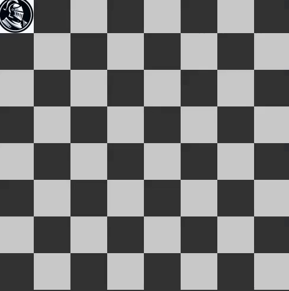

# knight-tour-pygame
Knight tour problem solved by backtrack algorithm. Visualizing with Pygame.

<p align="center">
  <video src="https://github.com/phantomf4321/Knight-tour-problem-pygame/assets/83742735/d185ca1c-045c-4d1c-8d20-336a81781b25" width="500px"></video>
</p>


### 8X8 Board


### output
```
| 0 | | 59 | | 38 | | 33 | | 30 | | 17 | | 8 | | 63 | 
-----------------------------------------------------
| 37 | | 34 | | 31 | | 60 | | 9 | | 62 | | 29 | | 16 | 
-----------------------------------------------------
| 58 | | 1 | | 36 | | 39 | | 32 | | 27 | | 18 | | 7 | 
-----------------------------------------------------
| 35 | | 48 | | 41 | | 26 | | 61 | | 10 | | 15 | | 28 | 
-----------------------------------------------------
| 42 | | 57 | | 2 | | 49 | | 40 | | 23 | | 6 | | 19 | 
-----------------------------------------------------
| 47 | | 50 | | 45 | | 54 | | 25 | | 20 | | 11 | | 14 | 
-----------------------------------------------------
| 56 | | 43 | | 52 | | 3 | | 22 | | 13 | | 24 | | 5 | 
-----------------------------------------------------
| 51 | | 46 | | 55 | | 44 | | 53 | | 4 | | 21 | | 12 | 
-----------------------------------------------------
```
